# cnfa_algs — Architecture & Module Map

*Last updated: 2026-07-15. Supersedes nothing; complements
[README.md](README.md) (run instructions) and [CONTRACT.md](CONTRACT.md)
(pipeline schema + delivery rules).*

---

## 1. What this package is

`cnfa_algs` is the **Cognitive Code computation engine** — the running
code that turns David Kirsh's cognitive-code dimensions (see
[VISION_AND_DIRECTION](../docs/VISION_AND_DIRECTION_2026-07-14.md) §2)
into computable, localizable, displayable annotations of interior spaces.

It reads a space from images / inferred plans / real plans and produces:
- **Scalar** attributes (normalised [0,1])
- **Field** maps (HxW heatmaps with iso-contours)
- **Region** evidence (bounding boxes, polygons, masks)
- **Confidence**, **method** tag, and **failure modes** per result

Everything flows through the `AttributeResult` schema in `core.py`.

---

## 2. Module dependency graph

```mermaid
graph TD
    subgraph "Foundation (no internal deps)"
        core["core.py<br/>AttributeResult, renderers"]
        geometry["geometry.py<br/>VP, planes, DepthProvider"]
        los["los.py<br/>line-of-sight ray-cast"]
        contracts["contracts.py<br/>PlanGrid, criteria constants"]
        setting["setting_classifier.py<br/>room type classifier"]
        hedonics["hedonics.py<br/>hedonic scoring"]
        activity["activity.py<br/>activity taxonomy + predictor"]
    end

    subgraph "Tier A — image-plane attributes"
        attributes["attributes.py<br/>14 pixel/structural attrs"]
        composition["composition.py<br/>rule of thirds, balance"]
    end

    subgraph "Tier B — plan inference"
        plan["plan.py<br/>infer_plan, isovist_fields"]
        spatial_syntax["spatial_syntax.py<br/>VGA + agent simulation"]
    end

    subgraph "Plan-space analysis"
        movement["movement.py<br/>circulation, wayfinding"]
        acoustics["acoustics_plan.py<br/>RT60, speech privacy"]
        daylight["daylight_view.py<br/>daylight, view quality"]
        thermal["thermal_plan.py<br/>thermal comfort zones"]
        space_syntax["space_syntax.py<br/>axial integration"]
        affordance["affordance.py<br/>prospect-refuge, territory"]
        wellbeing["wellbeing_plan.py<br/>biophilia, restoration"]
    end

    subgraph "Aggregation"
        score_layout["score_layout.py<br/>C1-C21 criteria scorer"]
        validate["validate_pipeline.py<br/>pipeline smoke test"]
        vlm_prompt["vlm_activity_prompt.py<br/>VLM prompt protocol"]
    end

    %% Dependencies
    attributes --> core
    attributes --> geometry
    composition --> core
    plan --> geometry
    spatial_syntax --> core
    spatial_syntax --> geometry

    movement --> los
    acoustics --> los
    daylight --> los
    thermal --> los
    space_syntax --> los
    affordance --> los
    wellbeing --> los

    score_layout --> movement
    score_layout --> acoustics
    score_layout --> daylight
    score_layout --> thermal
    score_layout --> setting
    score_layout --> space_syntax
    score_layout --> affordance
    score_layout --> wellbeing

    validate --> contracts
    validate --> movement
    validate --> acoustics
    validate --> daylight
    validate --> thermal
    validate --> setting
    validate --> space_syntax
    validate --> affordance
    validate --> wellbeing
    validate --> score_layout

    vlm_prompt --> activity
```



---

## 3. Module inventory

### Foundation layer (no internal dependencies)

| Module | Lines | Purpose | Key exports |
|--------|-------|---------|-------------|
| [core.py](core.py) | 160 | Result schema + rendering | `AttributeResult`, `heatmap_overlay`, `gallery`, `save_results_json` |
| [geometry.py](geometry.py) | ~240 | Vanishing point, plane segmentation, depth | `estimate_vanishing_point`, `segment_planes`, `DepthProvider`, plane constants |
| [los.py](los.py) | ~120 | Supercover line-of-sight on plan grids | `segment_is_free` |
| [contracts.py](contracts.py) | ~220 | PlanGrid schema, criteria constants (C1–C21) | `PlanGrid`, `Criterion`, `CRITERIA` |
| [setting_classifier.py](setting_classifier.py) | ~230 | Room-type classification from plan features | `classify_setting` |
| [hedonics.py](hedonics.py) | ~190 | Hedonic valence scoring (Kaplan, Berlyne) | `hedonic_score` |
| [activity.py](activity.py) | ~470 | Activity taxonomy (30 types) + attribute-based predictor | `ACTIVITIES`, `predict_activities`, `ActivityPrediction` |

### Tier A — image-plane attributes

| Module | Lines | Purpose | Attributes produced |
|--------|-------|---------|-------------------|
| [attributes.py](attributes.py) | ~500 | 14 pixel + structural attributes | `brightness_variance`, `edge_clarity`, `fractal_dimension_local`, `palette_entropy`, `processing_load`, `symmetry_horizontal`, `glare_risk`, `warmth_ratio`, `vertical_illuminance_proxy`, `enclosure_index`, `prospect`, `landmark_salience`, `acoustic_absorption_proxy`, `sociopetal_seating` |
| [composition.py](composition.py) | ~120 | Compositional analysis | `rule_of_thirds`, `visual_balance` |

### Tier B — plan inference + simulation

| Module | Lines | Purpose | Key exports |
|--------|-------|---------|-------------|
| [plan.py](plan.py) | ~280 | Floor plan inference from depth + isovist fields | `infer_plan_from_image`, `plan_from_floorplan_image`, `isovist_fields` |
| [spatial_syntax.py](spatial_syntax.py) | ~470 | VGA + agent-based pedestrian simulation | `floor_to_bev`, `compute_vga`, `simulate_agents`, `render_occupancy`, `compute_spatial_syntax_attributes` |

### Plan-space analysis (all depend on `los.py` for ray-casting)

| Module | Lines | Purpose | Key exports |
|--------|-------|---------|-------------|
| [movement.py](movement.py) | ~450 | Circulation, wayfinding, decision-point analysis | `score_movement` |
| [acoustics_plan.py](acoustics_plan.py) | ~390 | RT60 estimation, speech privacy zones | `score_acoustics` |
| [daylight_view.py](daylight_view.py) | ~280 | Daylight access, view quality scoring | `score_daylight_view` |
| [thermal_plan.py](thermal_plan.py) | ~370 | Thermal comfort zones, glazing effects | `score_thermal` |
| [space_syntax.py](space_syntax.py) | ~350 | Axial-line integration on plan grids | `score_space_syntax` |
| [affordance.py](affordance.py) | ~340 | Prospect-refuge, territory, social distance | `score_affordance` |
| [wellbeing_plan.py](wellbeing_plan.py) | ~390 | Biophilia, nature view, restoration potential | `score_wellbeing` |

### Aggregation layer

| Module | Lines | Purpose | Key exports |
|--------|-------|---------|-------------|
| [score_layout.py](score_layout.py) | ~600 | Composite C1–C21 criteria scorer | `score_layout`, `demo_scenario` |
| [validate_pipeline.py](validate_pipeline.py) | ~560 | Full pipeline smoke test | `validate_all`, `run_smoke` |
| [vlm_activity_prompt.py](vlm_activity_prompt.py) | ~430 | Structured VLM prompt for activity rating + second-pass occupancy query | `build_activity_prompt`, `parse_vlm_response`, `detect_disagreements`, `build_populated_prompt` |

### Supporting directories

| Path | Purpose |
|------|---------|
| `adapters/` | External model wrappers (SegFormer, SpatialLM, Structured3D, pyroomacoustics) |
| `validation/` | Credibility harness (probes, VLM judge, statistics) |

---

## 4. Data flow (how a single image becomes a full annotation)

```
IMAGE (BGR uint8)
  │
  ├─→ geometry.py: VP + planes + depth          ← Stage 0
  │
  ├─→ attributes.py: 14 Tier-A attributes       ← Stage 1a (parallel)
  ├─→ composition.py: rule_of_thirds, balance   ← Stage 1a
  │
  ├─→ plan.py: infer_plan → PlanGrid            ← Stage 1b (needs depth+planes)
  │     │
  │     ├─→ spatial_syntax.py: BEV → VGA → agents → occupancy  ← Stage 2a
  │     │     │
  │     │     └─→ vlm_activity_prompt.py: second-pass VLM query ← Stage 2b
  │     │
  │     └─→ plan.py: isovist_fields (openness, prospect, refuge) ← Stage 2a
  │
  ├─→ activity.py: predict_activities (from Tier-A scalars)     ← Stage 2a
  │
  └─→ core.save_results_json: merge all → JSON                 ← Stage 3
```

For **plan-space scoring** (when a real PlanGrid is available):

```
PlanGrid
  │
  ├─→ movement.py ─────┐
  ├─→ acoustics_plan.py ┤
  ├─→ daylight_view.py  ┤
  ├─→ thermal_plan.py   ├─→ score_layout.py: C1–C21 composite
  ├─→ space_syntax.py   ┤
  ├─→ affordance.py     ┤
  └─→ wellbeing_plan.py ┘
```

---

## 5. Scientific discipline

Every parameter that constitutes a design decision is documented in
[JUSTIFICATION_TABLE.md](JUSTIFICATION_TABLE.md) with:
- Citation (author, year, enough to find it)
- Rationale (1–2 sentences on *why* this value)
- Known limitations (what the source's original context was)

This is enforced by [.agents/AGENTS.md](../.agents/AGENTS.md). A
parameter without a documented justification is a contract violation.

---

## 6. Validation & adversarial review

| Artefact | Location | What it covers |
|----------|----------|---------------|
| Credibility harness | `validation/` | L0–L3 probes, VLM judge protocol, convergence stats |
| Adversarial review (30-probe) | `validation/ADVERSARIAL_REVIEW_2026-07-14.md` | 30 antagonistic inputs across 10 attack categories on Tier-A attributes |
| Adversarial review (spatial_syntax) | `validation/ADVERSARIAL_REVIEW_SPATIAL_SYNTAX_2026-07-15.md` | 25 probes by 4 simulated domain experts on the VGA + agent simulation |
| Unit tests | `tests/test_spatial_syntax.py` | 15 tests on synthetic grids (BEV, VGA, agents, rendering, full pipeline) |

---

## 7. What's NOT here yet (honest gaps)

- **No evaluative register** — the system describes, it doesn't critique
- **No comparative register** — no embedding / similarity index for search
- **No furniture segmentation** — agents walk through tables (adversarial finding #4)
- **No attractor model** — configuration only, no destination-driven movement
- **Scale ambiguity** — monocular depth has no metric scale
- **Single test file** — Tier-A attributes have validation probes but no pytest suite

See [VISION_AND_DIRECTION](../docs/VISION_AND_DIRECTION_2026-07-14.md)
§3 for the full roadmap of what remains.
