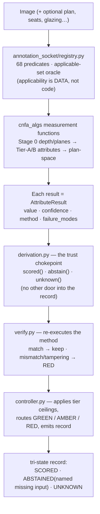

# Image Tagger: A Human Guide

*Software that looks at a picture of a room and tries to read the room the way an
architect or an environmental psychologist would — how enclosed, how bright, how
cluttered, whether you could find your way — and writes each reading down as a number
that carries its own confidence and its own list of ways it could be wrong.*

**For a person, not an agent.** This is a plain-language introduction; it assumes no
background in computer vision, environmental psychology, or the codebase (roughly
second-year-undergraduate level). To change code, start with
[`docs/REPO_STATE_MODEL_AND_PLAN.md`](REPO_STATE_MODEL_AND_PLAN.md) — a self-refreshing,
execution-verified map of the repository that answers *what will I break* (and warns, in
its own first sentence, that a newcomer told "work on the tagger" will probably edit the
wrong one of its two engines). This guide answers the prior question: *what is this for,
and why is it built the way it is.*
**Provenance convention:** **[verified]** = read out of this repository this session;
**[stated — DK]** = David Kirsh's stated intent, recorded as direction; **[in progress]**
= under active work; **[proposed]** = named as a next step, not built yet.

- `STATE_AS_OF: 2026-08-14`
- `JUDGED_REVIEWED: 2026-08-14`
- `STALE_AFTER_DAYS: 30`

> **Where this sits in the whole system.** Image Tagger is the **space-reader** — one
> organ of the larger enterprise described in [`../../SYSTEM_OVERVIEW.md`](../../SYSTEM_OVERVIEW.md)
> ("The Fourth Code"). Its job is the *feature* side of every "feature → effect" claim the
> system wants to make about a building: it computes a room's falsifiable attributes from
> visual input, and it is the place where the Cognitive, Emotional, Social, and Wellness
> code's operators actually run. The evidence engine (Article Eater / ATLAS) says how much
> to believe that a given feature produces a given effect; this repository is what produces
> the feature reading in the first place.

---

## 1 · The idea, in one paragraph

An experienced architect can look at a photograph of a lobby and say a great deal that is
not in the dimensions: that it is enclosing rather than open, that the glare off the glass
will fight the very conversations the room was built to host, that a visitor arriving from
the street will not immediately see where to go. Those readings are real, and they matter
for the people who will use the room, but they live in the reader's head and cannot be
searched, compared, or checked. This project tries to compute readings of that kind from an
image — and, where a floor plan or a 3-D model is available, from those too — and to write
each one down as a structured record rather than a loose adjective. The engine that does
this is `cnfa_algs` (the "cognitive-code" attribute engine), and its organizing discipline
is that **every attribute it emits carries not just a value but a confidence, the name of
the method that produced it, and an honest list of the ways that method can fail**
**[verified — the `AttributeResult` schema in `cnfa_algs/core.py` and the contract in
`cnfa_algs/CONTRACT.md`]**. So the point is not to label pictures. It is to turn a vague
word like *cluttered* into a detector that can be wrong and be caught, so that the rest of
the system — the part that knows how much the science supports "clutter raises cognitive
load" — has something concrete and gradeable to reason over.

## 2 · Why this is research and not just image tagging

It would be easy to mistake this for a tagging problem, where the job is to attach the
right labels to the right pictures, and the only question is accuracy. But the properties
that matter about a room are mostly not the ones a camera sees directly. Brightness and
colour and edges are on the surface; enclosure, prospect, refuge, wayfinding legibility,
reverberation, and restorative potential are not, and each has to be *composed* out of the
visible primitives by a stated rule and then checked against how people actually perceive
the space. The founding direction document frames this as reading a room across several
*registers* at once — the metric, the luminous, the material, the perceptual, the
affective, the affordance, the configurational — and it makes the sharp claim that the
interesting knowledge lives in the *relations between* registers, because that is where an
architect's own critique lives: "this foyer is beautiful, but its sightlines defeat
circulation, and its hard surfaces will make it acoustically hostile to the reception
conversations it was built to host" is a single judgement that reasons across three
registers at once **[verified — `docs/VISION_AND_DIRECTION_2026-07-14.md` §2]**.

Two further commitments are what make this genuinely a research programme rather than an
engineering one, and both are about honesty rather than cleverness. The first is that no
computed construct is allowed to float free of the measurable primitives beneath it, and no
attribute is allowed to speak as fact until it has been checked against human perception;
the engine climbs a deliberate ladder from pixel-level primitives, to perceptual and
material attributes composed from them, to the higher cognitive and affective constructs,
and it is supposed to carry an evidence tag at every rung **[verified — `VISION_AND_DIRECTION`
§8]**. The second is that the system is built to *refuse* certain claims. A single
photograph, run through monocular depth estimation, recovers depth only up to an unknown
scale, so the engine deliberately does not emit absolute metric numbers you could compare
across images, and it says so in its own limitations rather than quietly returning a
plausible figure **[verified — `cnfa_algs/README.md`, "Honest limits"; and the
`fail-closed` discipline in `CONTRACT.md`]**. A tool that hides where it is guessing is
worse than useless to an expert who will rightly distrust false precision, and much of the
work here is the machinery of not doing that.

## 3 · How the approach works

The engine reads a space at one of three fidelity tiers, and — this is the elegant part of
the design — the higher tiers reuse the same code as the lower ones, so a rough reading from
a single photo upgrades for free when a real plan arrives. Tier A works on a single image
and produces image-plane attributes and heatmaps. Tier B takes that same image, infers a
crude floor plan from estimated depth and plane segmentation, and runs true plan-space
analyses (visibility, prospect, refuge) on the inferred plan at reduced, honestly
discounted confidence. Tier C runs the identical plan-space code on a supplied floor plan
or BIM section, undiscounted **[verified — `cnfa_algs/README.md`]**.

Everything flows through one record type. When an attribute is computed it returns an
`AttributeResult` carrying a value (a `[0,1]` scalar, and/or a per-pixel field, and/or
labelled regions), a confidence, the method string, and the failure-mode list; the
pipeline's own contract validator rejects a result that omits its failure modes or hardcodes
its confidence to a perfect 1.0, on the reasoning that a process must state both how it
computes and where it breaks **[verified — `cnfa_algs/contracts.py` enforces a non-empty
`failure_modes` list; `CONTRACT.md` §3]**. Confidence propagates through composites by the
**weakest link** — a composite's confidence is the *minimum* of its components', never their
average, so a restoration score built on a low-confidence depth map cannot dress itself up as
certain **[verified — `CONTRACT.md` §5]**. What makes the research core more than a library,
though, is the wrapper around those functions. Every predicate is declared in a registry
(`annotation_socket/registry.py`) that lists, as data, what inputs each one *requires* and a
`tier_hint` that is an evidence **ceiling** rather than a target — a predicate riding
inferred (Tier-B) geometry is forbidden from ever claiming the top "GREEN" grade, because
GREEN is supposed to be an outcome of evidence and never something an operator awards itself.
There are exactly **68 predicates** registered (40 image attributes, 28 plan metrics); for a
bare photograph with no plan and no declared inputs, exactly **40 of the 68 apply**, nine
more become applicable once a plan is inferred, and the remaining nineteen must *abstain*,
naming the input they lack (seats, glazing, air spec, and so on) rather than inventing a
number **[verified — `REPO_STATE_MODEL_AND_PLAN.md` §5.2, re-derived by executing the
registry]**. Each believed number then passes through a single "trust chokepoint"
(`derivation.py`), whose only three doors are `scored()`, `abstain()`, and `unknown()`, so
that silence is structurally impossible and a reading with no evidence becomes UNKNOWN by
construction; and an independent checker (`verify.py`) *re-executes* the declared method
rather than trusting the annotator's own claim, returning RED on a mismatch or on any
tampering with a stored derivation. The controller applies the tier ceilings and routes each
unit as GREEN, AMBER, or RED, and only GREEN is accepted — a design in which the checker's
identity differs from the author's by topology, not by good intentions **[verified —
`REPO_STATE_MODEL_AND_PLAN.md` §1–§2 and the socket source it maps]**.

## 4 · What exists today — and the honest boundary

**First, the fact that governs everything else [verified].** The repository holds **two
independent attribute engines, and they are not yet wired to each other** — a state its own
map calls "the most important structural fact in this repository," because a newcomer told to
"work on the tagger's attributes" will, more likely than not, edit the wrong one
**[verified — `REPO_STATE_MODEL_AND_PLAN.md` §2]**. *Engine A* is the research core described
throughout this guide: the `annotation_socket` controller wrapped around the `cnfa_algs`
measurement functions, honest-by-construction and currently AMBER. *Engine B* is the
production web application (the `Image_Tagger_3.4.74_…` app root) that actually runs when a
user uploads a photo, with its own attribute vocabulary of roughly fifty-three entries in
`contracts/attributes.yml` and its own tests and governance. Engine A runs *parallel to*
Engine B and is not yet the canonical science-run inside the app; making it so is the central
item of the plan **[verified — `REPO_STATE_MODEL_AND_PLAN.md` §2, §6]**.

**What is built, in the research core [verified].** `cnfa_algs` exists as roughly two dozen
modules (the architecture doc inventories twenty-six). Tier A contributes fourteen
image-plane attributes; Tier B infers a plan and runs isovist fields; a family of plan-space
modules scores movement and wayfinding, acoustics, daylight and view, thermal comfort,
space-syntax integration, prospect-refuge affordance, and well-being; a space-syntax module
builds a bird's-eye occupancy grid and runs visibility-graph analysis and an agent-based
pedestrian simulation; and an activity module carries a thirty-type activity taxonomy. Every
scientific parameter is meant to be listed in a justification table with its citation,
rationale, and limitation, and where a value is only a project convention the table says so
in as many words **[verified — `cnfa_algs/ARCHITECTURE.md`, `CHANGELOG.md`,
`JUSTIFICATION_TABLE.md`]**. The engine has been through two written adversarial reviews (a
thirty-probe red team of the Tier-A attributes; a twenty-five-probe review of the space-syntax
simulation), and a first small credibility run against human-style judgements on eight images
found strong rank correlations for a couple of attributes (processing-load ρ ≈ 0.93,
enclosure ρ ≈ 0.81) **[verified — `CHANGELOG.md`]**.

**The honest boundary, stated plainly [verified].** The single most important distinction is
between *an operator being wired into the socket* and *an operator being validated against
human data*, and for most of the higher-level operators only the first is true. The
engine's own tier ceilings say this quantitatively: of the sixty-eight predicates, only
**nineteen are even capable of the top GREEN grade, and forty-nine are capped at AMBER by
construction** — every predicate that rides inferred Tier-B geometry is amber by design, not
by backlog **[verified — `REPO_STATE_MODEL_AND_PLAN.md` §5.2]**. The green-capable ones are
the simple, defensible primitives (brightness variance, edge clarity, symmetry, palette
entropy) and a handful of plan metrics fed by *declared* inputs. Beyond that ceiling, the
well-being operators are marked at best "DONE+EXT" — built, harness-tested, and reviewed by an
adversarial panel — but the boundary note attached to the whole set says that
**construct-validation against labelled human or biosignal data still remains owed for all of
them** **[verified — `docs/WELLBEING_CODE_AND_VIZ_OPERATORS_2026-07-18.md`]**. Two operators
were explicitly renamed and demoted to amber honest proxies after external attack — the
visual-discomfort spectral-slope statistic (which is *not* the 2-D Penacchio–Wilkins metric it
was mistaken for) and the fractal-fluency band — and the registry now carries those demotions
verbatim in its own notes. There is a subtler trap the state doc surfaces, worth repeating
because it is the kind of thing honesty is supposed to catch: the abstention contract, which
is this repository's central claim, can only be *exercised* on a machine that is missing the
optional libraries, so the better-provisioned the machine, the blinder its own governance
tests run — of the socket suite, 49 of 55 tests pass on the fully-equipped authoring Mac and
31 of 33 on a deprived Linux box, and **exactly one failure in either environment reflects a
real defect, and it is visible only on the deprived one** **[verified —
`REPO_STATE_MODEL_AND_PLAN.md` §5.3, §5.3b]**. Finally, two whole registers the vision names
as the point of the exercise — the *evaluative* (is this good, and for whom?) and the
*comparative* (find me spaces like this but better) — are essentially absent today: the system
as it stands **describes** a space, and does not yet **critique** it or search across spaces
**[verified — `cnfa_algs/ARCHITECTURE.md` §7 and `VISION_AND_DIRECTION` §2]**. None of this is
hidden; the maturity of each reading is built to travel with the reading itself.

## 5 · Where we're going

The strategic decision that orders everything is engine-first: the durable value, the thing
no competing system has, is a broad and *validated* attribute engine, and the search pages,
the critiques, and the affect scores are all consumers of it, only ever as trustworthy as
the attributes beneath them **[verified — `VISION_AND_DIRECTION` §8]**. So the near-term work
is to raise the floor by wiring already-collected external models into the existing
attributes — real segmentation, metric depth, and acoustic and daylight simulation, each of
which turns a proxy into a firmer measure and lets confidence rise on the same evidence —
and, in parallel, to deepen the engine into the registers where it is weakest, above all the
*morphological* reading of curvature, rhythm, and sculptural form, and real metric geometry
so that heights and dimensions carry scale **[verified — `VISION_AND_DIRECTION` §5, §6]**.
Running beside the engine work, rather than after it, is the search page and interactive
results viewer, because it is the thing that turns the engine into an instrument a
researcher can actually use, and because building it forces the creation of the comparative
embedding the engine needs anyway **[stated — DK; `VISION_AND_DIRECTION` §3.2, §6]**. Further
out, and gated by the two things above, come the composed judgements — critique of a real
space, and comparator search that ranks precedents by weighted similarity and by "better."
And there are two objects the wider system needs from this organ specifically: the *binding
object*, which would make executable the mapping from each computed attribute to the
construct it indexes, the level it acts at, the mechanism, and the literature warrant with
its evidence grade; and the *field visualizers*, which turn a bare number like "STI = 0.42"
into a picture of *where in the plan* intelligibility collapses, because a designer acts on
seeing, not on a scalar **[proposed — named as the current build front in
`../../SYSTEM_OVERVIEW.md` §4, §6]**.

## 6 · Milestones for the next phase

In rough order (the real milestones are capabilities and validation states, not calendar
dates):

1. **Raise the floor.** Wire the external segmentation, metric-depth, and simulation models
   into the existing attributes and re-run the credibility harness, so every downstream
   reading inherits firmer inputs. *Exit: existing attributes' confidence rises on the same
   evidence.* **[stated — DK]**
2. **Deepen the engine at its weakest register.** Build operational morphological attributes
   (curvature typology, rhythm, sculptural gesture) and metric geometry, each through the
   primitive → composite ladder and each gated by the harness. *Exit: the register where
   "rooms are not boxes" lives is computable and validated.* **[stated — DK]**
3. **The search page and interactive viewer.** A researcher queries spaces by attribute,
   then steers the result set with "more of this, less of that." *Exit: the engine is usable
   by the people it is for.* **[stated — DK]**
4. **Close the validation debt on the well-being and viz operators.** Move the amber
   proxies and the panel-reviewed operators toward construct-validation against labelled
   human and biosignal data. *Exit: operators may speak as fact, not as candidate.*
   **[in progress / proposed]**
5. **Compose into judgement.** The evaluative register (foyer goodness, circulation
   effectiveness) and the comparative register (precedent search) on top of a deeper engine.
   *Exit: the system can critique and compare, not only describe.* **[proposed]**
6. **The binding object and the field visualizers.** Make the attribute → construct mapping
   executable and the fields seeable. *Exit: a heat map becomes an evidence-bearing claim a
   designer can act on.* **[proposed]**

## 7 · Glossary — the terms that gate the reading

| Term | Meaning here |
|---|---|
| **attribute / `AttributeResult`** | one computed reading of a space, carrying value, confidence, method, and failure modes |
| **failure_modes** | the honest list of ways a method can be wrong; the contract rejects a result without it |
| **confidence / trust envelope** | how far to believe a reading; its status is *validated*, *proxy_validated*, or *untested* |
| **Tier A / B / C** | single image / image → inferred plan / supplied real plan or BIM — same code, rising fidelity |
| **primitive → composite ladder** | pixels → perceptual attributes → cognitive constructs, validated at every rung |
| **predicate / annotation socket** | an operator declared in the registry (`annotation_socket/registry.py`); 68 in all, 40 of them applicable to a bare photo |
| **isovist / prospect / refuge / enclosure** | what is visible from a point; openness, coverage, and how boxed-in a spot feels |
| **space syntax / VGA** | visibility-graph analysis of a plan; predicts where people move and gather |
| **cognitive vs. well-being code** | two readings off one annotation: can you think/navigate here vs. does it recover or load you |
| **GREEN / AMBER / RED** | a reading's grade; `tier_hint` is a *ceiling*, so a predicate on inferred geometry can never award itself GREEN |
| **proxy / AMBER** | an operator that computes something real but is *not* the validated instrument it gestures at |
| **checker ≠ author** | `verify.py` re-executes a method rather than trusting the annotator's claim; tampering yields RED |
| **abstain** | an operator's honest refusal to answer when its required input (e.g. a seat map) is absent |
| **min-not-mean** | a composite's confidence is the minimum of its parts', so the weakest link governs |
| **binding object** | the (proposed) executable map from an attribute to its construct, mechanism, and evidence grade |

## 8 · Further reading

- [`docs/REPO_STATE_MODEL_AND_PLAN.md`](REPO_STATE_MODEL_AND_PLAN.md) — the authoritative,
  self-refreshing state map: the two-engine structure, the call chain, every measured figure
  with the command that produced it, the newcomer traps, and the plan-to-green. Read this
  before changing code.
- [`docs/VISION_AND_DIRECTION_2026-07-14.md`](VISION_AND_DIRECTION_2026-07-14.md) — "Reading
  Space", the founding direction document: the register model, the six deliverables, and the
  engine-first plan. This guide is its plain-language front door.
- [`cnfa_algs/ARCHITECTURE.md`](../cnfa_algs/ARCHITECTURE.md) — the module map, dependency
  graph, and data flow; and the honest-gaps section. Read before changing engine code.
- [`cnfa_algs/CONTRACT.md`](../cnfa_algs/CONTRACT.md) — the pipeline schema, the confidence
  and adapter contracts, the last-mile success conditions, and the honest gap list.
- [`cnfa_algs/JUSTIFICATION_TABLE.md`](../cnfa_algs/JUSTIFICATION_TABLE.md) — every scientific
  parameter with its citation, rationale, and limitation (and the ones marked "no source").
- [`docs/WELLBEING_CODE_AND_VIZ_OPERATORS_2026-07-18.md`](WELLBEING_CODE_AND_VIZ_OPERATORS_2026-07-18.md)
  — the well-being operators, each with its science, location, importance, and — critically —
  its development and validation state.
- [`../../SYSTEM_OVERVIEW.md`](../../SYSTEM_OVERVIEW.md) — "The Fourth Code": how this
  space-reader fits with the evidence engine, the experiment side, and the VR platform as one
  system.

## Provenance

The two-engine structure, the call chain (registry → measurement → trust chokepoint →
method-replay checker → controller → tri-state record), the tier-ceiling discipline, and the
exact figures — 68 predicates (40 image, 28 plan; GREEN 19 / AMBER 49; 40 of 68 applicable to
a bare photo) and the socket test tallies (49 of 55 on macOS, 31 of 33 on Linux, exactly one
real defect) — are read this session from `docs/REPO_STATE_MODEL_AND_PLAN.md` §1–§2 and §5,
whose figures are re-derived by execution. The engine's structure (tiers A/B/C, the
twenty-six-module inventory, the fourteen Tier-A attributes, the plan-space and space-syntax
modules, the thirty-type activity taxonomy), the `AttributeResult` schema and its enforced
failure-mode disclosure, the confidence and weakest-link rules, the adversarial reviews, and
the small first credibility run are from `cnfa_algs/README.md`, `ARCHITECTURE.md`,
`CONTRACT.md`, `contracts.py`, `JUSTIFICATION_TABLE.md`, and `CHANGELOG.md`. The register
model, the six deliverables, and the engine-first sequencing are from
`docs/VISION_AND_DIRECTION_2026-07-14.md`. The well-being operators, their development states,
and the boundary that construct-validation against labelled human/biosignal data remains owed
for the whole set are from `docs/WELLBEING_CODE_AND_VIZ_OPERATORS_2026-07-18.md`. The organ
role (space-reader) and the binding-object and visualizer frontier are from
`/Users/davidusa/REPOS/SYSTEM_OVERVIEW.md`. Items marked [stated — DK] are recorded direction;
items marked [proposed] are named intentions, not existing code; the second-year-undergraduate
framing follows the fleet living-doc convention. No commercial or client-specific detail is
included, as this repository is public.
</content>
</invoke>
